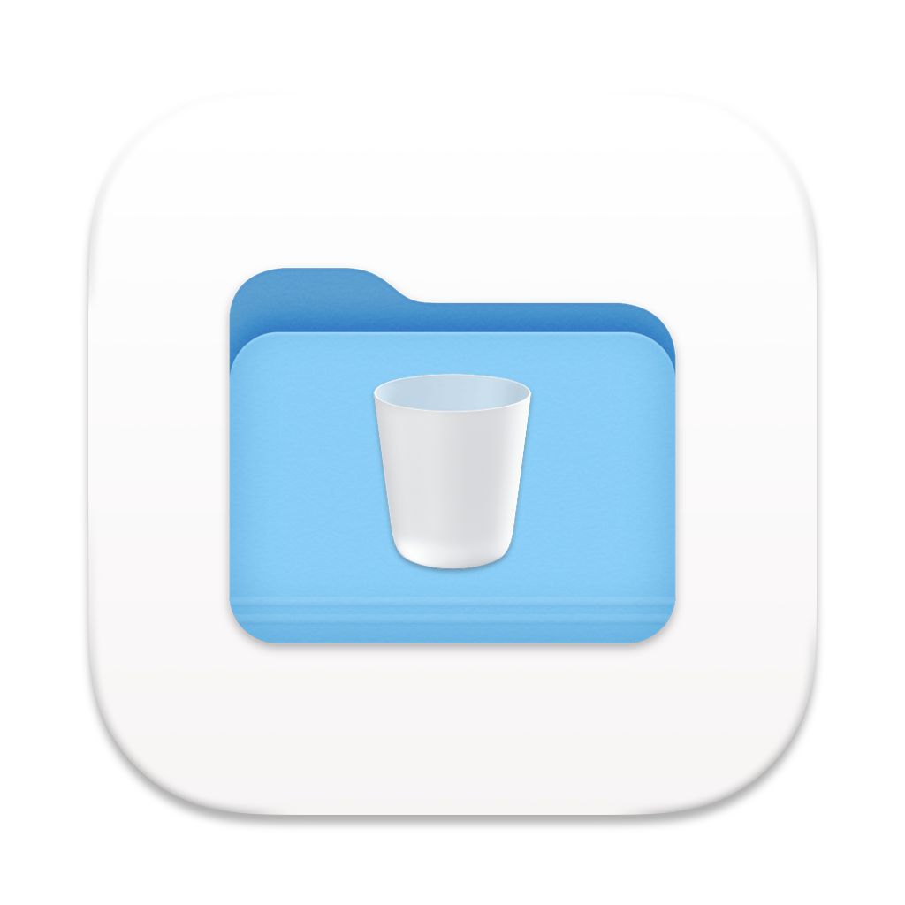
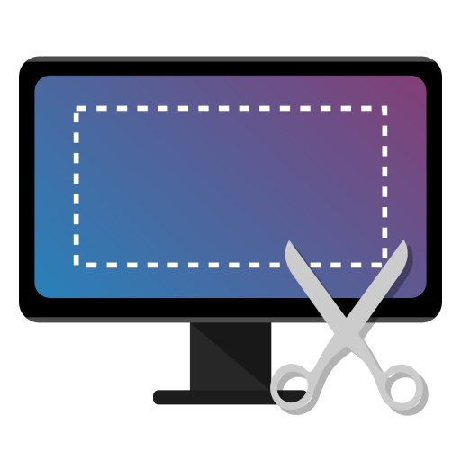
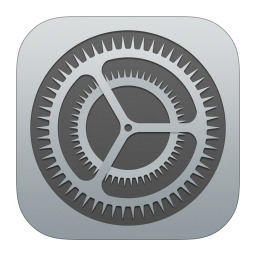
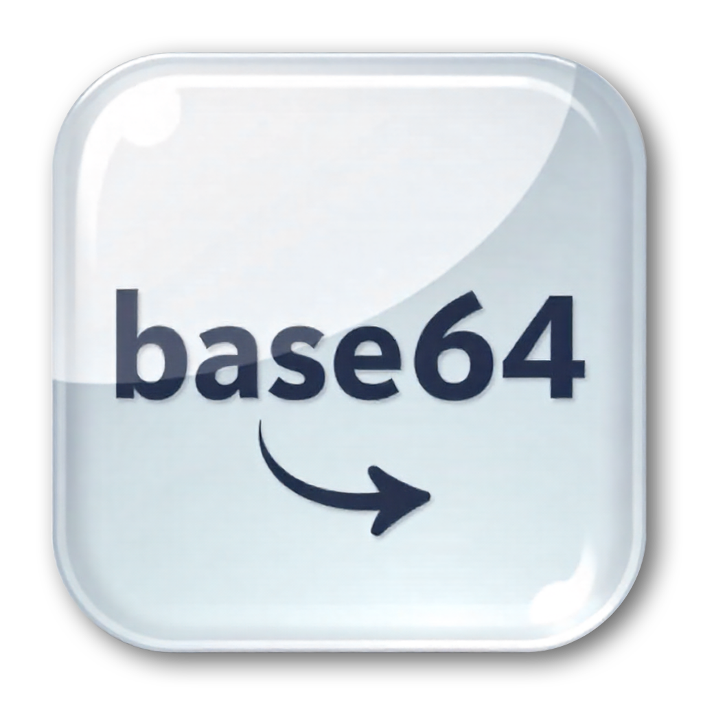
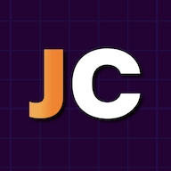
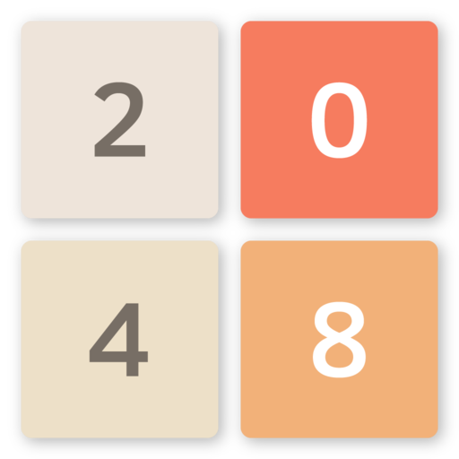
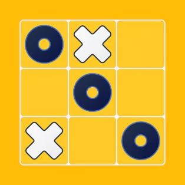
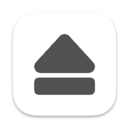
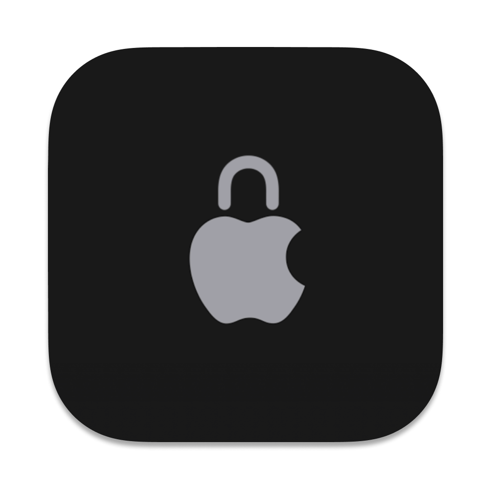

# 🧩 Coco AI Extensions

**The simplest and most powerful way to build and extend your own Coco.**

  
  

A community-driven collection of extensions for Coco AI.
 
Enhance your workflow with tools, games, and utilities designed to boost your productivity.

  
  &nbsp;
  
  &nbsp;
  

---

## 🚀 Contributing Extensions

We welcome contributions! Whether you've built a new tool or improved an existing one, share it with the community.
See the [documentation](docs) to get started.

## Extensions List

**By Author** | <a href="EXTENSIONS_BY_CATEGORY.md">By Category</a>

### INFINI Labs

<a href="extensions/infinilabs/empty_trash" title="📦 Empty Trash&#10;👤 By INFINI Labs&#10;&#10;📝 Empties the trash on macOS." style="text-decoration:none;color:inherit;">

Empty Trash

</a>
<a href="extensions/infinilabs/screenshot" title="📦 Screenshot&#10;👤 By INFINI Labs&#10;&#10;📝 Provides various commands for taking screenshots on macOS." style="text-decoration:none;color:inherit;">

Screenshot

</a>
<a href="extensions/infinilabs/suspend" title="📦 Suspend&#10;👤 By INFINI Labs&#10;&#10;📝 Suspend your machine." style="text-decoration:none;color:inherit;">

Suspend

</a>
<a href="extensions/infinilabs/system_settings" title="📦 System Settings&#10;👤 By INFINI Labs&#10;&#10;📝 Provides shortcuts to various system settings on macOS." style="text-decoration:none;color:inherit;">

System Settings

</a>
<a href="extensions/infinilabs/uuid_generator" title="📦 UUID Generator&#10;👤 By INFINI Labs&#10;&#10;📝 Copy generated UUIDs to the clipboard" style="text-decoration:none;color:inherit;">

UUID Generator

</a>

### Medcl

<a href="extensions/medcl/angry_bots" title="📦 Angry Bots&#10;👤 By Medcl&#10;&#10;📝 Play Angry Bots within Coco" style="text-decoration:none;color:inherit;">

Angry Bots

</a>
<a href="extensions/medcl/base64-converter" title="📦 Base64 Converter&#10;👤 By Medcl&#10;&#10;📝 A simple web-based tool to encode or decode Base64 strings or files. Supports text and file conversion with instant results, dark mode, and downloads." style="text-decoration:none;color:inherit;">

Base64 Converter

</a>
<a href="extensions/medcl/json_editor_viewer_formatter_json_crack" title="📦 JSON Editor/Viewer/Formatter (JSON Crack)&#10;👤 By Medcl&#10;&#10;📝 JSON Editor/Viewer/Formatter, powered by JSON Crack" style="text-decoration:none;color:inherit;">

JSON Editor/Viewer/Formatter (JSON Crack)

</a>
<a href="extensions/medcl/qq_music_controls" title="📦 QQ Music Controls&#10;👤 By Medcl&#10;&#10;📝 Control QQ Music playback and volume with quick commands via AppleScript. Supports play, pause, next, previous, volume up/down, mute toggle, like/unlike song, and more." style="text-decoration:none;color:inherit;">

QQ Music Controls

</a>
<a href="extensions/medcl/sound_volume_controls" title="📦 Sound Volume Controls&#10;👤 By Medcl&#10;&#10;📝 Quickly control your Mac's sound volume with simple, step-based commands. Includes mute toggle, stepped volume levels, and volume queries." style="text-decoration:none;color:inherit;">

Sound Volume Controls

</a>

### Rain9

<a href="extensions/rain9/netease_music_controls_en" title="📦 NetEaseMusic Controls English Version&#10;👤 By Rain9&#10;&#10;📝 Control NetEaseMusic playback and volume with quick commands via AppleScript. Supports play, pause, next, previous, volume up/down, mute toggle, like/unlike song, and more." style="text-decoration:none;color:inherit;">

NetEaseMusic Controls English Version

</a>
<a href="extensions/rain9/netease_music_controls_zh" title="📦 网易云音乐控制中文版&#10;👤 By Rain9&#10;&#10;📝 通过 AppleScript 使用快速命令控制网易云音乐的播放和音量。支持播放、暂停、下一首、上一首、音量调高/调低、喜欢/不喜欢歌曲、退出等功能。" style="text-decoration:none;color:inherit;">

网易云音乐控制中文版

</a>

### Steve Lau

<a href="extensions/stevelauc/2048" title="📦 2048&#10;👤 By Steve Lau&#10;&#10;📝 Play 2048 game within Coco" style="text-decoration:none;color:inherit;">

2048

</a>
<a href="extensions/stevelauc/clipboard_json_formatter" title="📦 Clipboard JSON Formatter&#10;👤 By Steve Lau&#10;&#10;📝 Format JSON content directly from your clipboard and save the formatted result back. Ideal for quick inspection, editing, or sharing of JSON data." style="text-decoration:none;color:inherit;">

Clipboard JSON Formatter

</a>
<a href="extensions/stevelauc/duckdb_wasm_shell" title="📦 DuckDB WASM shell&#10;👤 By Steve Lau&#10;&#10;📝 Run DuckDB WASM within Coco" style="text-decoration:none;color:inherit;">

DuckDB WASM shell

</a>
<a href="extensions/stevelauc/spotify_controls" title="📦 Spotify Controls&#10;👤 By Steve Lau&#10;&#10;📝 Control Spotify playback with commands to play/pause, and skip to the next or previous track." style="text-decoration:none;color:inherit;">

Spotify Controls

</a>
<a href="extensions/stevelauc/tic-tac-toe" title="📦 React Tic-Tac-Toe&#10;👤 By Steve Lau&#10;&#10;📝 A small Tic-Tac-Toe game introduced in the React tutorial" style="text-decoration:none;color:inherit;">

React Tic-Tac-Toe

</a>

### ayangweb

<a href="extensions/ayangweb/eject_all_disks" title="📦 Eject All Disks&#10;👤 By ayangweb&#10;&#10;📝 Ejects all mounted disk images." style="text-decoration:none;color:inherit;">

Eject All Disks

</a>
<a href="extensions/ayangweb/lock_screen" title="📦 Lock Screen&#10;👤 By ayangweb&#10;&#10;📝 Lock the screen of your macOS." style="text-decoration:none;color:inherit;">

Lock Screen

</a>
<a href="extensions/ayangweb/open_trash" title="📦 Open Trash&#10;👤 By ayangweb&#10;&#10;📝 Open trash folder in Finder." style="text-decoration:none;color:inherit;">

Open Trash

</a>

### fishsoup

<a href="extensions/fishsoup/apple_music_controls" title="📦 Apple Music Controls&#10;👤 By fishsoup&#10;&#10;📝 Control Apple Music playback and manage tracks. Includes playback toggles, navigation, and track managements." style="text-decoration:none;color:inherit;">

Apple Music Controls

</a>
<a href="extensions/fishsoup/google_chrome_controls" title="📦 Google Chrome Controls&#10;👤 By fishsoup&#10;&#10;📝 Control Google Chrome with quick commands via AppleScript. Support new windows,new incognito windows, new tabs, search history, search tabs, search online, and more." style="text-decoration:none;color:inherit;">

Google Chrome Controls

</a>
<a href="extensions/fishsoup/reminder_controls" title="📦 Apple Reminders Controls&#10;👤 By fishsoup&#10;&#10;📝 Quickly manage Apple Reminders. View, create, and delete completed reminders." style="text-decoration:none;color:inherit;">

Apple Reminders Controls

</a>
<a href="extensions/fishsoup/spotify_controls" title="📦 Spotify Controls 2&#10;👤 By fishsoup&#10;&#10;📝 Quickly control Spotify via AppleScript. Supports playback, navigation, shuffle, repeat, seeking, and track info." style="text-decoration:none;color:inherit;">

Spotify Controls 2

</a>
<a href="extensions/fishsoup/vscode_controls" title="📦 Visual Studio Code Controls&#10;👤 By fishsoup&#10;&#10;📝 Quickly control Visual Studio Code via AppleScript and CLI commands. Supports opening new windows, opening selected files or folders from Finder, and managing and installing extensions." style="text-decoration:none;color:inherit;">

Visual Studio Code Controls

</a>
<a href="extensions/fishsoup/zoom_controls" title="📦 Zoom Controls&#10;👤 By fishsoup&#10;&#10;📝 Quickly control Zoom meetings on macOS via AppleScript keystroke shortcuts. Supports scheduling, starting, and joining meetings." style="text-decoration:none;color:inherit;">

Zoom Controls

</a>

