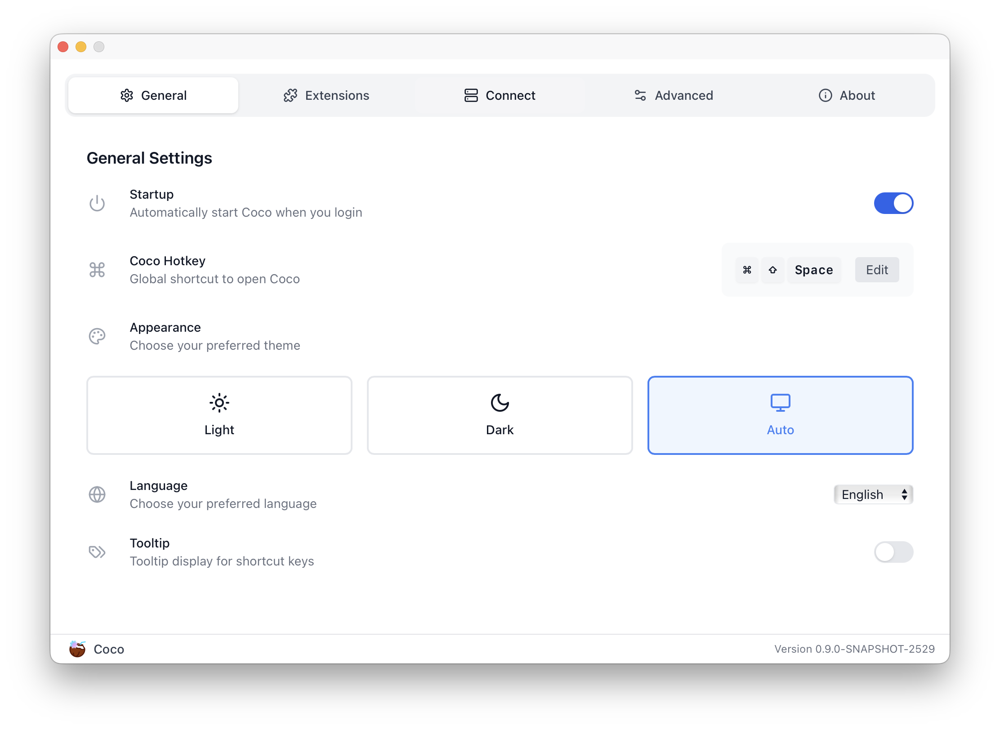
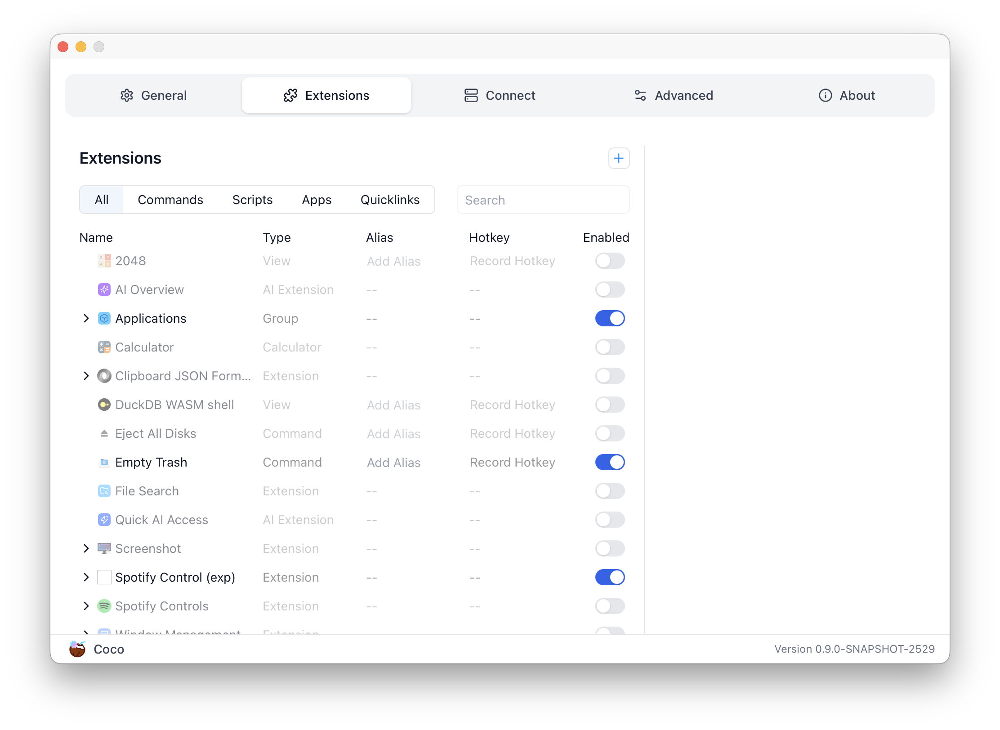
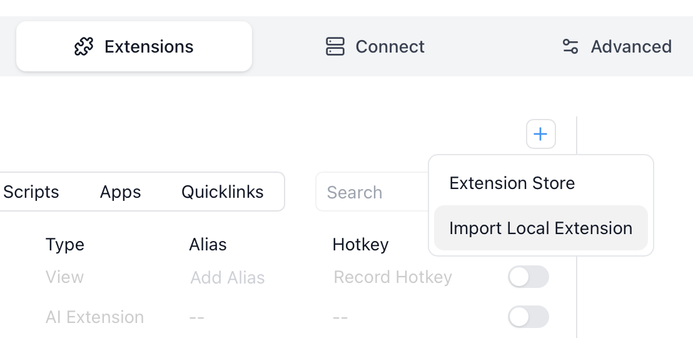
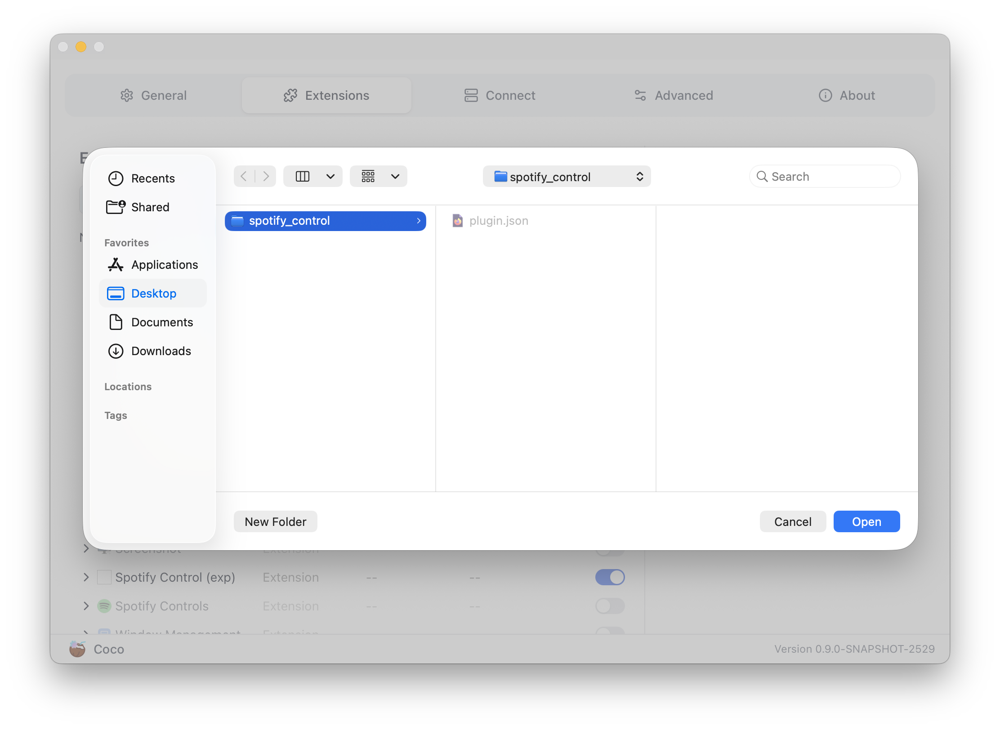

# Import your extensions to Coco

You can import the extension you developed to Coco to test if it will work as 
expected.

1. Open Coco settings page

   

2. Navigate to the "Extensions" tab

   

3. Click the "+" button then choose "Import Local Extension"

   

   This will launch your OS's file manager

4. Select the directory of your extension, then click the "Open" button

   

   NOTE that you should select the extension directory, not the developer 
   directory.