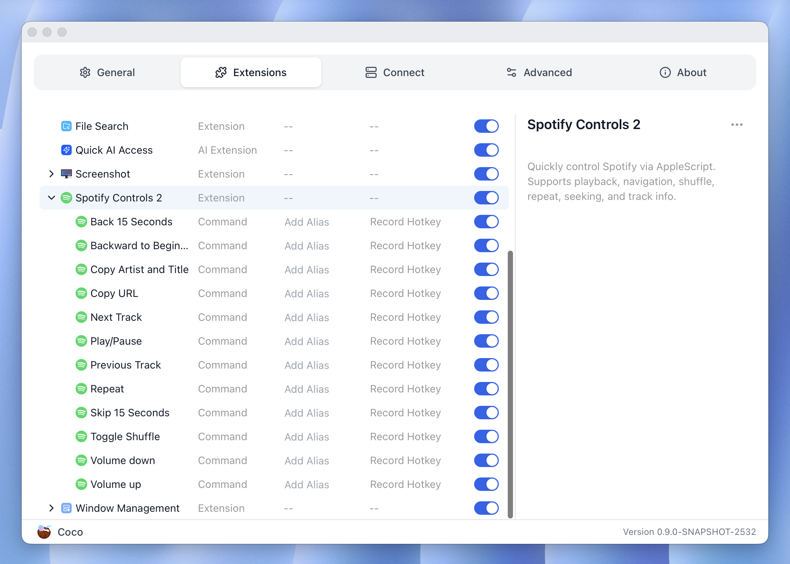
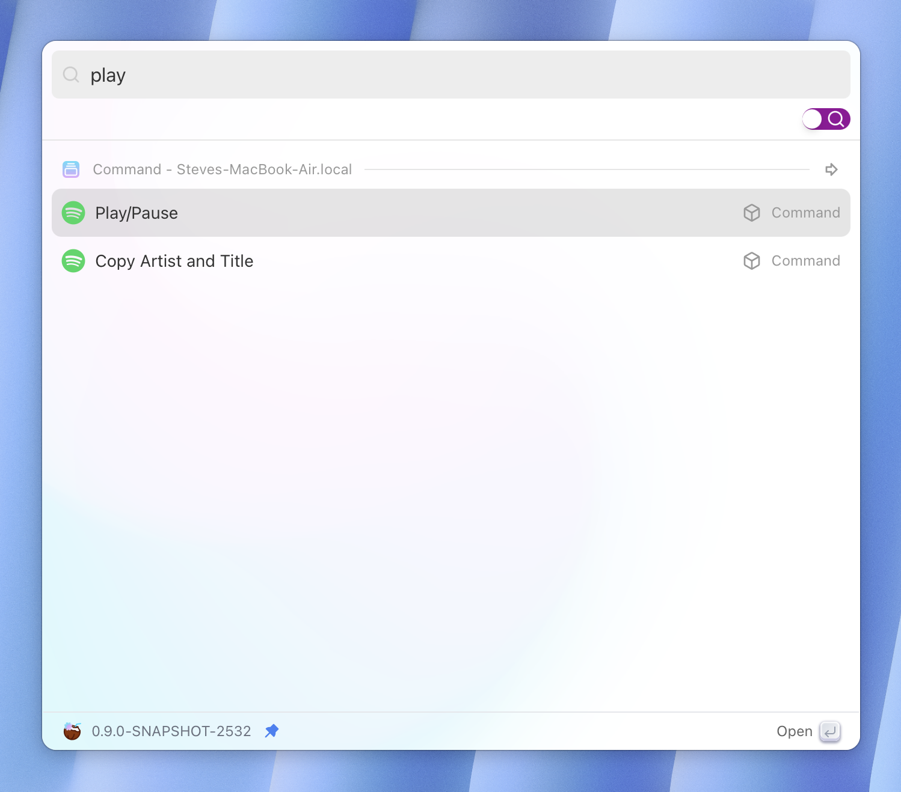

# Your first Command extension - Spotify Control

In this tutorial, we will show you how to develop your first Command
extension to control the Spotify macOS app.

If you are interested, here is how the extension you are going to build looks 
like. And you can also [install][install_link] it from the Extension Store to
actually try it out!




The Spotify macOS app exposes AppleScripts that allow you to control it from the
command line, which is where Coco Command extensions shine.


```sh
$ mkdir spotify_control && cd spotify_control
$ touch plugin.json
```


Create a project folder anywhere you want, and then create a `plugin.json` file inside it.
`plugin.json` is the core file that describes the extension, every Coco extension
starts from this.


Then edit the `plugin.json`, populate the basic fields:

```json
{
  "name": "Spotify Control",
  "type": "extension",
  "platforms": [
    "macos"
  ],
  "icon": "bring your own icon",
  "description": "Control Spotify playback with commands to play/pause, and skip to the next or previous track.",
  "commands": [...]
}
```

The type of this extension is `extension`, which behaves like a container for 
sub-commands. Since this extension leverages AppleScripts, it is macOS-only, so 
the `platforms` fields only contains "macos".

You can choose your own icon, I am going to omit that for simplicity. Then we add a 
"description" field. 

Sub-commands are declared in the "commands" field, which is an array of JSON 
objects. There objects are similar to the one we have here, except with a 
different type `command`.

```json
{
  "commands": [
    {
      "name": "Toggle Play/Pause",
      "type": "command",
      "icon": "bring your own icon",
      "description": "Toggles play or pause of current track in Spotify.",
      "action": {
        "exec": "osascript",
        "args": [
          "-e",
          "tell application \"Spotify\" to playpause"
        ]
      }
    }
  ]
}
```

Here is our first command: "Toggle Play/Pause". As you can see, its type is 
`command`. Similarly, it has its own "icon" and "description". We omit the 
"platform" field because all these commands support the same platforms supported
by the main extension. The "action" field is a field exclusive to Command 
extensions, it defines the action that will be performed when we run this 
extension, i.e., to run a command. 

```json
{
  "exec": "osascript",
  "args": [
    "-e",
    "tell application \"Spotify\" to playpause"
  ]
}
```

We run Apple Script from CLI via the `osascript` command, the above JSON is 
equivalent to doing this in your shell:

```sh
$ osascript -e 'tell application "Spotify" to playpause' 
```

Once you understand how this command works, it is easy to replicate it to create 
other commands. You can view the full command list [here][spotify_control_extension_link].

For how to test the extension you developed, see [Import your extension to test it][import].
    
    
[spotify_control_extension_link]: https://github.com/infinilabs/coco-extensions/blob/main/extensions/fishsoup/spotify_controls/plugin.json
[import]: ./import_your_extension_to_test_it.md
[install_link]: https://coco.rs/en/integration/extensions/detail?id=94799349426cbf3f76b2bcfb50865952
