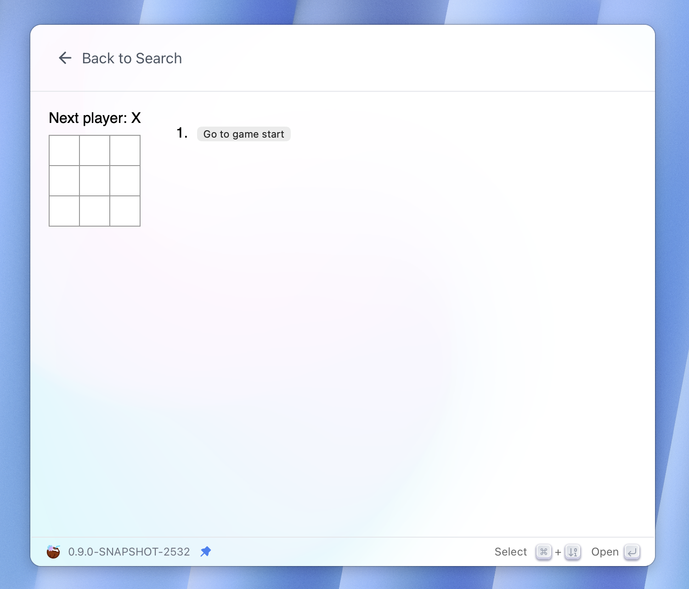

# Your first View extension - A small tic-tac-toe game

This tutorial will show you how to build your first View extension, a game 
that you can play right in the Coco AI app.

Still Curious? Here’s a preview of the extension. You can even [install][install_link] 
it from the Extension Store and try it out for real!



View, as its name implies, displays a custom user interface.
Think of it like a canvas where you are free to draw anything you want!

You can "draw" using any web stack you love; They all work as long as they
generate an HTML page that Coco can load and render. I am going to use React 
and demonstrate it with the project introduced in the React tutorial: Tic-Tac-Toe.

Please ensure you have `npm` installed, clone the repository, then build the 
project:

```sh
$ git clone https://github.com/infinilabs/react-tic-tac-toe.git --depth 1
$ cd react-tic-tac-toe
$ npm install
$ npm run build
```

`npm run build` will create a `build` directory in the project root, you should
find files similar to:

```sh
$ ls -l build
.rw-r--r--  369 steve 10 Oct 11:14 asset-manifest.json
.rw-r--r--@ 322 steve 10 Oct 11:14 index.html
drwxr-xr-x    - steve 10 Oct 11:14 static
```

With the project built successfully, we can now create a `plugin.json` file to 
turn it into a Coco extension:

```sh
$ touch plugin.json
```

```json
{
  "name": "React Tic-Tac-Toe",
  "description": "Play Tic-Tac-Toe game",
  "icon": "logo.jpg",
  "type": "view",
  "platforms": [
    "macos",
    "windows",
    "linux"
  ],
  "page": "build/index.html"
}
```

The structure should be familiar if you have experience with [Command extensions][cmd_ext_tutorial]. 
The main differences are the extension type (now `view`) and the new `page` field. 
The `page` should be the path to the HTML page we talked about earlier. In our case, it would 
be the `index.html` file under the `build` directory.

You can also add an icon for the extension. The recommended way to do this is 
to create an `assets` directory in the extension root, place your icon there, 
and then update the `icon` field in `plugin.json` with the filename.

And that's it! create a web project, build it, and add a `plugin.json` file to 
describe it. It's that simple.

[cmd_ext_tutorial]: ./your_first_command_extension_Spotify_Control.md
[install_link]: https://coco.rs/en/integration/extensions/detail?id=399ba003cba2de349bce608f48dfd725